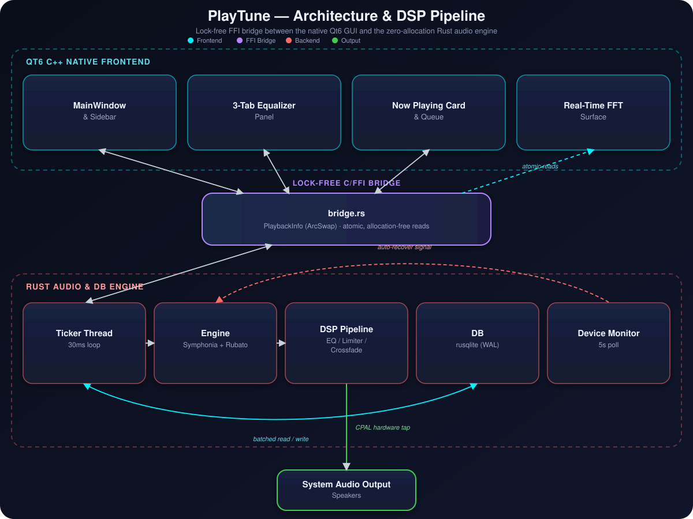

<div align="center">


<br/>

[](https://www.rust-lang.org/)
[](https://www.qt.io/)
[](#)
[](#)
[](LICENSE)


<br/>

<p>
  <a href="#-why-playtune"><b>Why PlayTune</b></a> •
  <a href="#-see-it-in-action"><b>Screenshots</b></a> •
  <a href="#-core-highlights"><b>Highlights</b></a> •
  <a href="#-architecture--dsp-pipeline"><b>Architecture</b></a> •
  <a href="#-workspace-crates"><b>Crates</b></a> •
  <a href="#-getting-started"><b>Quickstart</b></a> •
  <a href="#-performance-invariants"><b>Invariants</b></a>
</p>

</div>

<br/>

## 🔥 Why PlayTune?

Modern music players often suffer from bloat — running inside heavy web views with multi-gigabyte memory footprints, garbage collection pauses, and sluggish UI responses.

**PlayTune takes a radical, uncompromising approach:**
It fuses a **thin, high-refresh-rate C++ Qt6 native interface** with a **raw, zero-allocation Rust audio engine** over an ultra-fast C/FFI bridge. The result is sub-millisecond audio frame delivery, instant application startup, zero GC stutter, and true audiophile control over every sample.

<div align="center">

| 🐢 Typical Electron Player | ⚡ PlayTune |
| :---: | :---: |
| 300–500 MB idle RAM | **~30 MB idle RAM** |
| GC pauses & jank | **Zero-allocation hot path** |
| Chromium bootstrap delay | **Instant native launch** |
| Generic system codecs | **Pure-Rust Symphonia decoding** |

</div>

<div align="center">

`⚡ 0 heap allocations on the audio thread`  ·  `🎚️ 65-bin real-time FFT`  ·  `🧵 5 dedicated background threads`  ·  `🎧 7 codecs, 1 pure-Rust decoder`  ·  `🌍 Linux · Windows · macOS`

</div>

> [!NOTE]
> If you can hear the difference between a good DAC and a bad one, you'll feel the difference between PlayTune and everything else on this list.

---

## 📸 See It In Action

<div align="center">


<sub>✨ Dark-themed glass aesthetics · 65-bin real-time FFT spectrum tap · Now-Playing waveform · 3-tab segmented equalizer workstation · Smart library views ✨</sub>

</div>

---

## ⚡ Core Highlights

<table>
<tr>
<td width="50%" valign="top">

### 🎧 Zero-Allocation Audiophile Engine
`modules/engine`

- **True Zero-Allocation Hot Path** — resampling (`rubato 0.15`), crossfading, and DSP filtering run entirely inside pre-allocated ring/scratch buffers. Not one heap allocation on the audio thread.
- **Multi-Format Symphonia Decoding** — MP3, FLAC, WAV, AAC, OGG, OPUS in pure, safe Rust.
- **Automatic Bluetooth & Sink Hand-Offs** — `tc-device-monitor` polls OS audio config every 5s and renegotiates sample rate on the fly.
- **Resilient Async Recovery** — hot-swaps CPAL streams via 5ms interruptible polling if a device drops, keeping Play/Pause/Volume instantaneous.
- **Acoustic Spike Protection** — `volume.snap()` on track load eliminates dangerous full-volume bursts.

</td>
<td width="50%" valign="top">

### 🖥️ Native Qt6 C++ GUI & Tooltip Engine
`modules/gui`

- **Live 65-Bin FFT Spectrum Visualizer** — powered by `realfft`, zero UI-thread stalling, gracefully mocked when idle.
- **Custom Styled Tooltips App-Wide** — dark-themed overlays with shortcuts and exact parameter values.
- **Instant Global Tooltip Toggle** — installs/removes a `QEvent::ToolTip` filter live from Settings.
- **Ergonomic Sidebar Navigation** — Songs, Folders, Favorites, Recently Played, Most Played, Settings.
- **Debounced Search & Queue Panel** — instant filtering (`Ctrl+F` / `Return`) plus a queue manager with artwork.

</td>
</tr>
</table>

### 🎛️ 3-Tab Segmented Equalizer & DSP Workstation

PlayTune replaces cluttered sliders with an elegant, **context-aware 3-tab segmented control suite**:

| Workstation Tab | Key Capabilities & Controls |
| :--- | :--- |
| **🎚️ 10-Band Graphic EQ** | ISO bands (`31 Hz`–`16 kHz`) rendered with smooth Catmull-Rom splines. **7 curated genre presets** (*Flat, Pop, Rock, Jazz, Classical, Electronic, Hip Hop*) plus manual custom memory. |
| **🎛️ Tone & Spatial Controls** | **Bass & Treble** shelf filters, 3D **Stereo Width** (`0%–200%`), Left/Right **Balance**, and master **Preamp Gain**. |
| **🔬 Advanced Parametric EQ** | Full 10-band precision editor. Filter shapes (*Peaking, Low Shelf, High Shelf, Low Pass, High Pass, Bandpass, Notch*), Quality Factor (`Q` `0.1`–`24.0`), center frequency (`20 Hz`–`20 kHz`), plus **Resampler Quality Selection** (*Fast, Balanced, High Quality 4x, Ultra HD*). |

> [!TIP]
> **Context-Aware Reset Button** — Clicking *Reset* only clears settings within your active tab, so you can flatten graphic EQ curves without losing your custom parametric filters.

<details>
<summary><b>🗃️ Concurrent WAL SQLite Library</b> — <code>modules/db</code> + <code>modules/library</code></summary>
<br/>

- **Single-Pass Metadata & Artwork Extraction** — recursive scans (`walkdir`) pull ID3/Vorbis tags plus album artwork in one unified file read (`symphonia` + `image`).
- **Lock-Free WAL Mode** — SQLite runs in **Write-Ahead Logging**, enabling concurrent imports while you search and stream without lock contention.
- **Sub-Millisecond Batch Inserts** — transactional batch flushes index thousands of tracks in seconds.

</details>

<details>
<summary><b>🧠 Intelligent Mood Analyzer & Automatic Track Classifier</b> — <code>modules/analysis</code></summary>
<br/>

- **DSP Feature Extraction** — Computes spectral centroid, signal energy, zero-crossing rate, loudness, and tempo attributes across audio files.
- **Automated Track Classification** — Categorizes library tracks into 7 distinct mood states (*Calm*, *Energetic*, *Happy*, *Sad*, *Romantic*, *Party*, *Luft*).
- **One-Click Sidebar Filtering & Visual Badges** — Interactive Mood sidebar presets and color-coded table badges for seamless music browsing.

</details>

<details>
<summary><b>🌐 Deep OS Media Key & Desktop Integration</b> — via <a href="https://github.com/Sinono3/souvlaki"><code>souvlaki</code></a></summary>
<br/>

| Operating System | Native System Bridge | Supported Media Actions |
| :--- | :--- | :--- |
| 🐧 **Linux** | MPRIS D-Bus Service | Broadcasts real-time metadata (Title, Artist, Album, Artwork, Duration) to system notifications and handles media keys. |
| 🪟 **Windows** | SystemMediaTransportControls (SMTC) | Full lock-screen and taskbar media overlay control. |
| 🍎 **macOS** | MPRemoteCommandCenter | Native Touch Bar and Control Center synchronization. |

</details>

---

## 🏗️ Architecture & DSP Pipeline

PlayTune enforces a strict **separation of concerns**: the C++ GUI holds zero business logic, communicating with the Rust engine purely through lock-free atomic buffers (`ArcSwap<PlaybackInfo>`) and a concurrent command channel (`crossbeam`).

<div align="center">



</div>

### 🧵 Multithreaded Execution Model

| Thread | Cadence | Responsibility |
| :--- | :---: | :--- |
| **Main UI Thread** | — | Runs the native Qt6 event loop with high responsiveness |
| **Ticker Thread** | `30ms` | Ticks the audio engine, syncs UI state, dispatches FFT bars, detects end-of-stream advances |
| **Device Monitor Thread** | `5s` | Monitors OS default audio devices/sample-rate shifts to trigger hot-swapping |
| **Media Key Thread** | `200ms` | Polls `souvlaki` desktop media action channels |
| **Library Scan Thread** | on-demand | Background folder traversal and batch SQLite transactions |

---

## 📦 Workspace Crates

No monolith, no spaghetti — just seven focused crates that each do one thing well.

<div align="center">

| Crate Name | Path | Core Responsibilities |
| :--- | :--- | :--- |
| **`playtune`** | `src/` | Root binary, FFI C bridge exported to Qt, global `OnceLock` statics, Qt6 process init |
| **`engine`** | `modules/engine/` | Decoding (`symphonia`), ring buffers, resampler (`rubato`), DSP filters, CPAL output, recovery |
| **`db`** | `modules/db/` | Concurrent SQLite persistence: tracks, play stats, favorites, folder registry |
| **`library`** | `modules/library/` | Recursive directory traversal, single-pass metadata extraction, cover art decoding |
| **`platform`** | `modules/platform/` | OS media key listeners and MPRIS / SMTC / MPRemoteCommandCenter bridges |
| **`config`** | `modules/config/` | Serialized player preferences, EQ bands, window geometry (`serde`) |
| **`analysis`** | `modules/analysis/` | Audio feature extraction (energy, spectral centroid, ZCR, tempo), automated mood classification & real-time FFT utilities |

</div>

---

## 🚀 Getting Started

### 1️⃣ Prerequisites

| Tool / Dependency | Required Version | Purpose |
| :--- | :--- | :--- |
| **Rust Toolchain** | `1.75+` stable | Core backend compilation (`rustup`) |
| **Qt6 SDK** | `6.2+` | C++ GUI widget development headers |
| **CMake & C++ Compiler** | `3.16+` / C++17 | Required by `build.rs` to compile the Qt6 frontend |
| **ALSA & D-Bus** | — | Linux only (`libasound2-dev` and `libdbus-1-dev`) |

<details>
<summary><b>📥 Quick package installation commands</b></summary>
<br/>

**Debian / Ubuntu**
```bash
sudo apt update && sudo apt install build-essential cmake pkg-config qt6-base-dev libasound2-dev libdbus-1-dev
```

**Fedora / RHEL**
```bash
sudo dnf install cmake pkg-config qt6-qtbase-devel alsa-lib-devel dbus-devel
```

</details>

### 2️⃣ Build & Launch

```bash
# Clone the repository
git clone https://github.com/shadow7534128/playtune.git
cd playtune

# Build and launch in release mode (essential for zero-latency audio processing)
cargo run --release
```

> [!IMPORTANT]
> **Why `--release` is required**: Audio DSP pipelines and multi-band Catmull-Rom resamplers demand aggressive compiler optimization (`codegen-units = 1`, `lto = true`). Running in debug mode (`cargo run`) may cause CPU throttling and audio underruns.

### 3️⃣ Debug & Verbosity Controls

```bash
RUST_LOG=info cargo run --release    # Standard operational info
RUST_LOG=debug cargo run --release   # Verbose DSP & database traces
```

---

## 📖 How to Train Your Model (Developer Guide)

1. Open PlayTune and create playlists starting with `Mood - ` (e.g. `Mood - Happy`, `Mood - Sad`, `Mood - Energetic`, `Mood - Calm`, `Mood - Romantic`, `Mood - Party`, `Mood - Lofi`).
2. Add songs into their corresponding mood playlists.
3. Run the export CLI command:
   ```bash
   cargo run -- export-training-data
   ```
   *This automatically generates `training_dataset.csv`.*
4. Train the LightGBM models:
   ```bash
   python3 tools/train_mood_model.py training_dataset.csv assets/mood_models.json
   ```
5. Done! The updated `assets/mood_models.json` will be shipped with PlayTune and automatically classify all user songs on scanning.

---

## ⚡ Performance Invariants

Every contribution to PlayTune must respect three foundational performance rules:

> [!CAUTION]
> **Invariant 1 — Zero Allocation on Audio Hot Paths**
> Functions executing on the CPAL audio output callback or inside `decode_and_process` **must never allocate heap memory** (`Vec::new()`, `Box::new()`, `String::clone()`). All buffers must be pre-allocated during pipeline construction.

> [!IMPORTANT]
> **Invariant 2 — Batch I/O for Database Operations**
> Single-row inserts inside loops are strictly forbidden. All directory scans must group writes into SQLite transactions of at least `100` items to maintain sub-millisecond audio thread responsiveness.

> [!TIP]
> **Invariant 3 — No Production `unwrap()`**
> Errors across all modules must be propagated using `anyhow::Result` or logged with structured warnings. `unwrap()` and `expect()` are restricted exclusively to `#[cfg(test)]` blocks.

```toml
# Optimized Cargo Release Profile
[profile.release]
lto = true          # Full Link-Time Optimization across all workspace crates
strip = true        # Strip debug symbols for compact binary delivery
codegen-units = 1   # Single codegen unit for maximum function inlining
panic = "unwind"    # Enables safe catching of unwinds inside FFI callbacks (std::panic::catch_unwind)
```

---

## 🤝 Contributing & License

We love contributions! Whether you're optimizing DSP SIMD loops, polishing Qt dark themes, or adding audio analysis tools:

1. Fork the repository and create your feature branch (`git checkout -b feat/my-cool-feature`)
2. Verify code quality:
   ```bash
   cargo fmt --all && cargo clippy --workspace --all-targets -- -D warnings
   cargo test --workspace
   ```
3. Submit your Merge / Pull Request!

<div align="center">
<a href="https://github.com/shadow7534128/playtune/graphs/contributors">
  
</a>
</div>

PlayTune is open-source software licensed under the **Apache-2.0 License**. See [LICENSE](LICENSE) for full details.

<br/>


<div align="center">
<sub>Built with 🦀 Rust & ⚡ Qt6 C++ — engineered for uncompromising acoustic perfection.</sub>
</div>